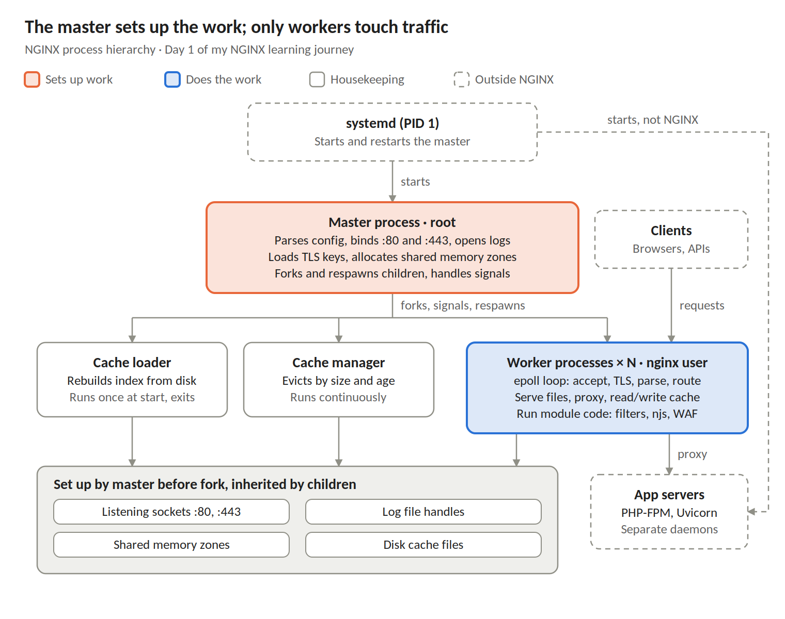

# NGINX Learning Journey, Day 1: Architecture, processes, and signals

Day 1 is done a tad late, but I think the extra time paid off.

I started with setup. I installed NGINX mainline from the [nginx.org](https://nginx.org) repo instead of Ubuntu's package, mostly because it includes an `nginx-debug` binary and stays current. I disabled the packaged service and will start early running each lab from its own directory in my repo, with a small shell helper so every command targets the right instance. Docker is installed for test backends, and Kubernetes comes later.

Most of the day went into questions, mostly around how NGINX does things compared to BIG-IP. NGINX workers map closely to TMMs: one event loop per core, with no shared state unless you explicitly create a shared memory zone. The master process never touches traffic. It parses config, binds ports, loads keys, starts the workers, and then sleeps until it gets a signal. One difference I want to remember: a crashed worker isn't like a TMM core. The master starts a replacement, and only that worker's connections are lost.

A few other things clicked along the way:

- `epoll` on Linux and `kqueue` on BSD/macOS are alternatives, not complementary. Each OS uses one.
- When NGINX serves static files, the "backend" is just the filesystem. Each `location` picks exactly one source for the response.
- App servers like PHP-FPM and Uvicorn are separate daemons that NGINX talks to...was curious how NGINX was different than NGINX Unit in this regard. Unit tried to merge these concepts into one power house, with programmatic configuration to boot! But alas, it is archived now, though a community fork called FreeUnit carries it on.
- The cache loader and cache manager run as their own processes so disk scans never block a worker.
- Modules are loaded by the master but run inside the workers.
- OSS passive health checks are basically inband monitors.
- "Upstream" comes from the HTTP specs, where content flows from the origin down to clients. I get it, but I don't like it. Pools and pool members is better. I said what I said.

The labs had their own lessons:

- Running `nginx -s reload` from a lab directory without the right flags reads the wrong PID file.
- In `ss` output, the "users" field shows process names, not the user accounts.
- Learning some new Linux commands along the way, love it!

I scored 8 out of 10 on the quiz. I missed where a `location` block is allowed, and I mixed up USR2 and HUP. Fittingly, Day 2 is all about location matching. Will wrap Day 2 in a Friday night evening session, after I spend time with the family.

#NGINX #F5 #LearningInPublic #DevOps
