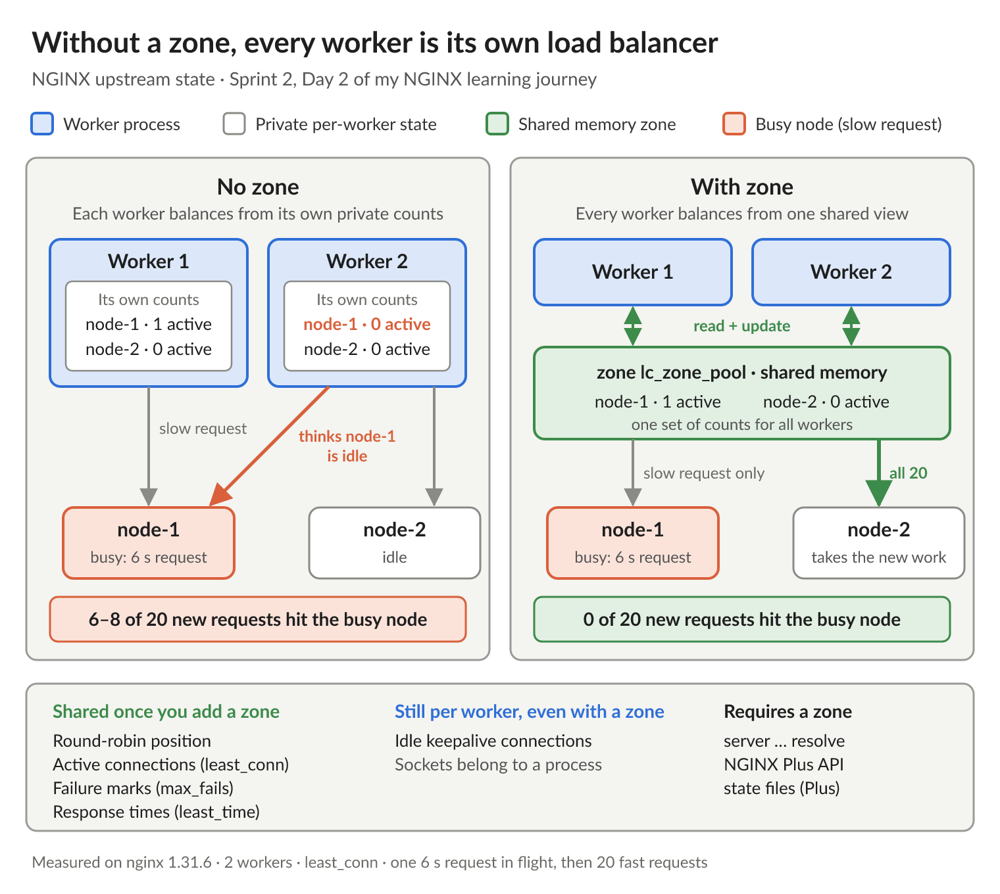

# NGINX Learning Journey, Sprint 2 Day 2: Load balancing, shared state, and connection reuse

Day 2 of the reverse proxy sprint was load balancing, which is home turf coming from BIG-IP. That turned out to be the risk. Most of my questions today were about where BIG-IP intuition quietly gives the wrong answer.

Config first. The load balancing method isn't an attribute with a value. It's a bare directive (`least_conn;`, `ip_hash;`), because each method is its own module, and leaving it out means round robin. Declare two and NGINX doesn't fail; it warns, and the last one wins. Weight defaults to 1 like a BIG-IP ratio, but you'll never see it in the config.

Where my BIG-IP habits would have misled me:

- `backup` is not a priority group. It's binary: no backup for the backup, and no minimum active members. It can also kick in for a single request while every primary is healthy. With both primaries answering 503, one request walked node 1 → node 2 → backup, and the next request went straight back to a primary.
- `least_conn` counts connections that are carrying a request, not idle pooled ones. That makes it closer to Fastest (application) than to BIG-IP's Least Connections.
- Weight isn't always a ratio. With weight 3 vs 1, round robin, `least_conn`, `random`, and both hash flavors all landed 3:1. `least_time` sent 400 of 400 requests to the heavier server when both backends were equally fast. For the methods that measure something, weight biases the comparison rather than setting a share.
- Because methods are modules, features don't combine freely. `backup` works with round robin, `least_conn`, and `least_time`, but `hash`, `ip_hash`, and `random` reject it at `nginx -t`. On BIG-IP, method, priority groups, and OneConnect are independent knobs.
- `least_time` is passive. It learns from real response times, with no probes.

The biggest concept of the day was `zone`. Workers share nothing unless the upstream has a shared memory zone, so without one you're running a separate load balancer per worker. It showed up all over the lab:

- `least_conn` with one slow request in flight: without a zone, 6 to 8 of 20 new requests still went to the busy node. With a zone, 0 of 20.
- Right after the primaries recovered, the split between primary and backup varied from run to run without a zone (6/4, 8/2, 10/0). With a zone it was identical every time.
- `resolve` won't even load without one.

Even with a zone, idle keepalive connections stay per worker. I need to stop assuming BIG-IP-style box-wide member status.

Connection reuse is basically OneConnect, with a few nuances. NGINX always balances per request, reuse or not. The pool is per worker, and since 1.29.7 per location by default. `keepalive N` caps idle connections only. The lifecycle settings map to OneConnect's max age, max reuse, and idle timeout (`keepalive_time` 1h, `keepalive_requests` 1000, `keepalive_timeout` 60s). It has the same NTLM trap, too. The good news: since nginx 1.29.7, reuse is on by default. Before that, NGINX's default was the equivalent of running HTTP without OneConnect.

Lab surprises:

- Consistent hashing earned its keep. Adding a third node moved 79 of 200 keys, all of them onto the new node. Plain hashing moved 136 and reshuffled keys between the old nodes too.
- `ip_hash` from a single client put 100 of 100 requests on one node. Every office behind one NAT gets the same treatment.
- `TIME_WAIT` lands on whoever closes the connection first. 200 requests without reuse left 200 `TIME_WAIT` sockets on the backend, not on NGINX.
- On loopback, Linux hands out the same ports again right away, so a repeating source port proves nothing about connection reuse.

Day 3 is failure handling and WebSockets, where passive health checks and that per-worker state come back around.

#NGINX #F5 #LearningInPublic #DevOps
