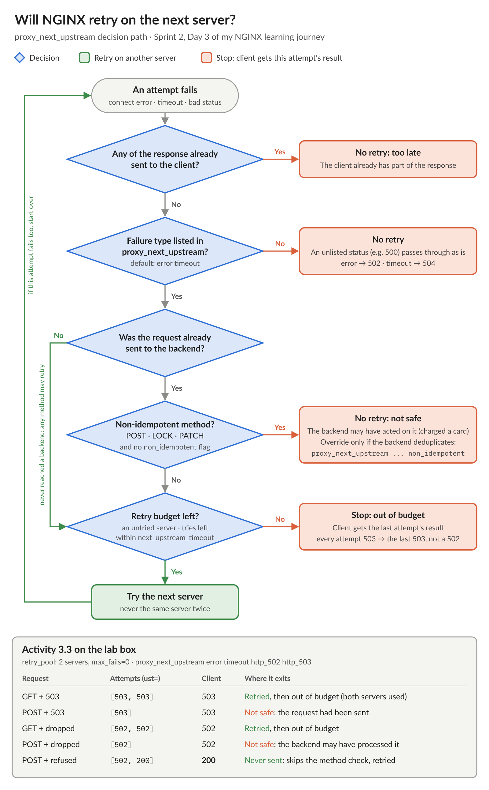

# NGINX Learning Journey, Sprint 2 Day 3: Failure handling, retries, and WebSockets

Day 3 was about what happens when backends fail. On BIG-IP, an active monitor marks a member down before most clients ever notice. NGINX open source has no monitor. It learns that a server is down only when a real client request to it fails, so every failure costs somebody something, and the question becomes who pays and how much.

Passive marking, and per-worker state again:

- With 8001 stopped, all 24 requests still returned 200. `proxy_next_upstream` retried each failed connect on 8002 before the client saw anything. The clients that hit 8001 first still paid for a failed connect.
- Without a `zone`, the dead node was tried 3 times. With a zone, it was tried exactly `max_fails` (2) times. The error log showed why: one worker reached its 2 failures and marked 8001 down, and the other worker had 1 failure and never did. With a zone, both workers add to the same count, and the second failure takes the node out for everyone.
- The `*11` in an error log line is a connection serial number from a counter shared by all workers, not a request count. `grep '\*11 '` pulls every line for that one connection, a bit like following a flow on BIG-IP.

Whether NGINX retries is decided by a short chain of checks, and the lab results land exactly where the flowchart predicts:

The rule that matters most: a `POST` that never reached a backend (connection refused) is retried, but a `POST` that was sent and then dropped is not, because the backend may already have charged the card. `non_idempotent` overrides that, and should only be used when the backend deduplicates.

Where my BIG-IP habits would have misled me:

- **Worst-case latency is not 3n+1.** 3n+1 is how long a monitor takes to *detect* a down member. NGINX's tries × timeout is how long *one request* can wait. It works out to about min(tries, servers) × (connect time + read timeout). NGINX never tries the same server twice, so 3 tries against a 2-server pool with a 15 s read timeout is 30 s, not 45 s. A blackholed backend costs `proxy_connect_timeout` (60 s by default) per attempt.
- **Timeouts measure gaps, not totals.** A backend that sends a byte every 14 s never hits a 15 s `proxy_read_timeout`. `proxy_next_upstream_timeout` only stops a *new* attempt from starting. It never shortens the one that's running.
- **502 vs 504 comes down to whether a timer ran out.** Refused, closed early, invalid header, or no live upstreams: 502. Connect or read timer expired: 504. The same dead host can produce either one, depending on whether it refuses the connection (502) or drops the SYN (504). A BIG-IP with no available members resets the connection by default; NGINX always answers with a status, so the code itself is the first clue.
- **After retries, the client gets the last attempt's result.** If every attempt returned 503, the client gets the last 503, not a 502.

WebSockets were the other half of the day. `Upgrade: websocket` is the client's request to switch protocols, and `101 Switching Protocols` is the backend agreeing. NGINX doesn't decide either one. It forwards the request, and only turns the connection into a tunnel when it sees the 101. `Upgrade` is a hop-by-hop header, so it has to be forwarded explicitly with `proxy_set_header`, which BIG-IP's HTTP profile mostly does for you. Once the tunnel is up, `proxy_read_timeout` becomes the idle limit.

Building the Lumina lab, syntax was the hard part:

- I missed 5 closing semicolons. `nginx -t` reports the error on the line *after* the missing `;`, which makes it harder to spot.
- Time values take a unit (`proxy_read_timeout 3s`, `fail_timeout=5s`), and a bare number means seconds. Counts can't have one (`max_fails=2`, `proxy_next_upstream_tries 2`, `keepalive 32`). I put the `s` in the wrong places in both directions.
- All tests passed except the health check. The requirement was only "200 JSON from NGINX", and my `{"status": "ok"}` met it, but the test looked for the word `healthy`, which only the solution used. That one goes on the list for the next sprint, along with a starter config that gave a little too much advice.

I scored 7 out of 10 on the quiz the first time and 8 out of 10 on the retake. The misses were 502 vs 504 and `Upgrade` vs `101`.

Day 4 is the enterprise side quest: NGINX Plus upstreams, and changing a pool through an API instead of editing config and reloading.

#NGINX #F5 #LearningInPublic #DevOps
