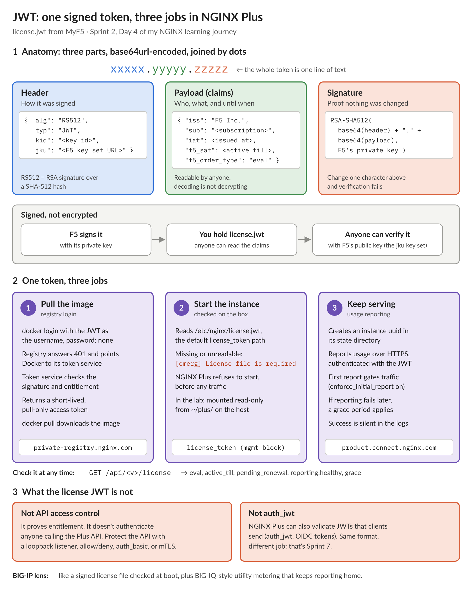

# NGINX Learning Journey, Sprint 2 Day 4: NGINX Plus upstreams, and what a reload really costs

Day 4 was the first Enterprise Side Quest: managing an upstream pool in NGINX Plus through its API, set against what open source NGINX can do. I ran both side by side on the same box: open source on the host, and NGINX Plus in a container hitting the same mock backends.

## The open source way: edit, then reload

In open source, the pool is part of the config, so every change is an edit plus a reload. Two things made that loop much easier to see.

**Changing config from the command line.** Instead of opening an editor, each change was a single `sed` that rewrote one `server` line in place: add node 3 after node 2, append `drain;` to it, or deliberately break it with `weight=x`. It's fast and scriptable, and it taught me two lessons the hard way:

- A `sed` that *adds* a line adds it again every time it runs. Running it twice left node 3 in the pool twice, once with `drain` and once without. NGINX accepted both and treated them as separate servers, so the plain copy kept taking traffic and the drain did nothing. BIG-IP won't let you add the same member to a pool twice. NGINX doesn't even warn.
- A `sed` whose pattern doesn't match changes nothing, silently. Check the line with `grep` before reloading.

**Reloading through the control socket.** Open source NGINX 1.31.5 added a control API, served on a local Unix socket when you start NGINX with `-l`. It doesn't touch the traffic path. The master opens one extra root-only socket, and that's it. A `PATCH` to its config endpoint does the same reload as `nginx -s reload`, but it **reports the result in the response**:

- `{"logs":[]}` means the new config is live.
- A bad config comes back as the actual error: `[emerg] invalid parameter "weight=x" in nginx.conf:36`. The old config keeps serving traffic the whole time.

With `nginx -s reload` you send a signal and then go read `error.log`. On BIG-IP terms, it's a tiny local iControl that can show processes and run `tmsh load sys config`. It can't change pool members.

What the reload cost, made visible:

- **Every old worker is retired**, not just one. Workers with nothing open exit immediately.
- **A long-lived connection pins its old worker.** With a WebSocket chat open, the old worker sat in `worker process is shutting down` until the chat closed. With `proxy_read_timeout 3600s`, that's up to an hour per reload. An autoscaler adding a node every minute could stack up dozens of worker generations.
- **`drain` exists in open source now** (1.29.6+), with or without a `zone`. Node 3 went from 6 of 20 requests to 0. But it's a config parameter, so draining is a reload too.

## The NGINX Plus way: change the pool in place

The Plus API treats the upstream as a resource and each server in it as a sub-resource with an id. Starting from an empty pool, I added two servers with `POST`, scaled out to a third, drained it with one `PATCH`, and deleted it, all while the worker PIDs stayed exactly the same. No reload, no new workers, and a WebSocket would have been untouched.

- **The `state` file is the source of truth.** NGINX Plus writes every API change to disk and reads it back at startup, so the pool survived a container restart. It also survived my rerun: when I started Activity 3.3 over, the "empty" pool already had last run's servers in it.
- **Ids are never reused.** Re-added servers get new ids, which is why the guide looks servers up by address.
- **`slow_start` was the fun one.** After a node recovered, its share of traffic climbed gradually over 30 seconds instead of jumping straight back. It's the same idea as BIG-IP's slow ramp time, but per server.
- BIG-IP mapping: `drain` ≈ member **Disabled** (only `sticky`-bound requests still go there), `down` ≈ **Forced Offline**, and the `state` file ≈ a config save that happens automatically on every change.

Two things are deliberately out of scope today. **Active health checks** are the side quest for Sprint 12; Day 4 is about changing a pool, and Sprint 12 is about probing it. **NGINX One Console**, the fleet view and the closest thing to BIG-IQ, is in Sprint 11.

## Getting started with NGINX Plus in a lab

Everything in NGINX Plus licensing hangs off one file, `license.jwt`, so it's worth knowing what's inside it:

Most of today's time went into getting the first container running, which is normal for a first install. I wrote all of it into a lab convention so every future side quest starts the same way:

- **One license file, one place.** The `license.jwt` from MyF5 lives in `~/plus/` on the host, outside the repo, and is mounted into the container at the path NGINX Plus reads by default. The same JWT is also the username for logging in to F5's private registry, with the password literally `none`. Docker's warnings about passwords on the command line and credentials stored in `config.json` are fine on a single-user lab box.
- **Pin a release tag.** Tag naming changed between releases: R36 is `r36-debian`, R37 is `r37.1-debian`, and there's no plain `r37`. I briefly thought R36 was the newest release because I was filtering for the old pattern. Floating tags like `debian` silently jump to the next release on the next pull, so the lab pins one.
- **Use `--mount`, not `-v`.** My first container start failed with `License file is required`. The shell had an empty `$HOME`, so the license path didn't exist. When a `-v` source is missing, Docker quietly creates a directory there and mounts it. `--mount` refuses to start instead, which is what you want.
- **Ask the API which version it speaks.** Each NGINX Plus release serves a range of API versions. R36 stopped at 9, while R37 serves 1 to 10, so hard-coding 10 broke on R36. `GET /api/` lists the supported versions, and the lab's helper picks the newest.
- **A successful license check is quiet.** NGINX Plus logs licensing only when something is wrong. The confirmation is in the API: `/license` shows the first usage report succeeded, when the trial ends, and a 180-day grace period if reporting ever fails later. The rest of the container's startup output comes from the image's own scripts and process manager, not from NGINX, so I filter for NGINX's log lines.

A small thing that made a big difference: a handful of one-line shell functions. The control socket reload went from 90 characters to 30, a Plus API call from 76 to 14, and a 20-request traffic tally (a curl loop piped through `jq`, `sort`, and `uniq`) from 115 characters to a single word. That's what made it practical to rerun the activities as many times as I did.

I scored 10 out of 10 on the Day 4 quiz on the first attempt.

Sprint 3 starts Monday: TLS termination and edge hardening, with TLS 1.3, HTTP/2, and HTTP/3.

#NGINX #F5 #LearningInPublic #DevOps
